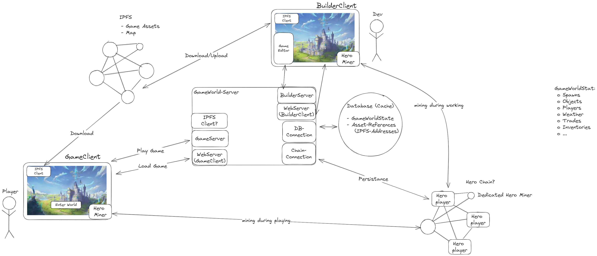
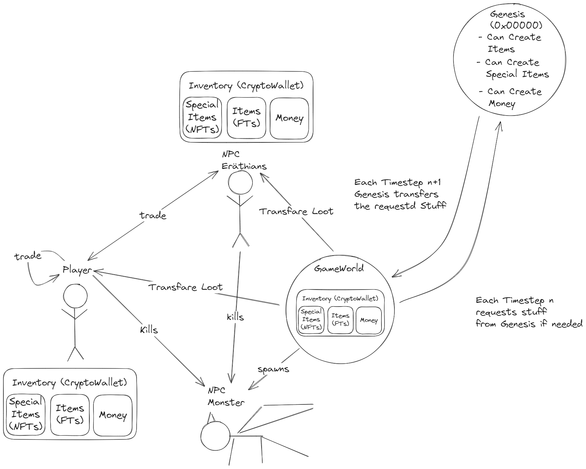
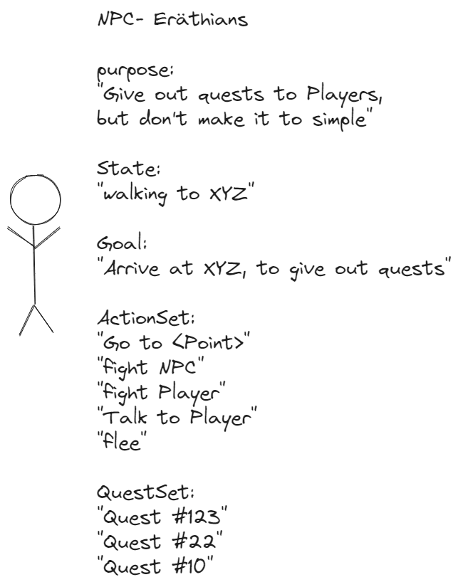
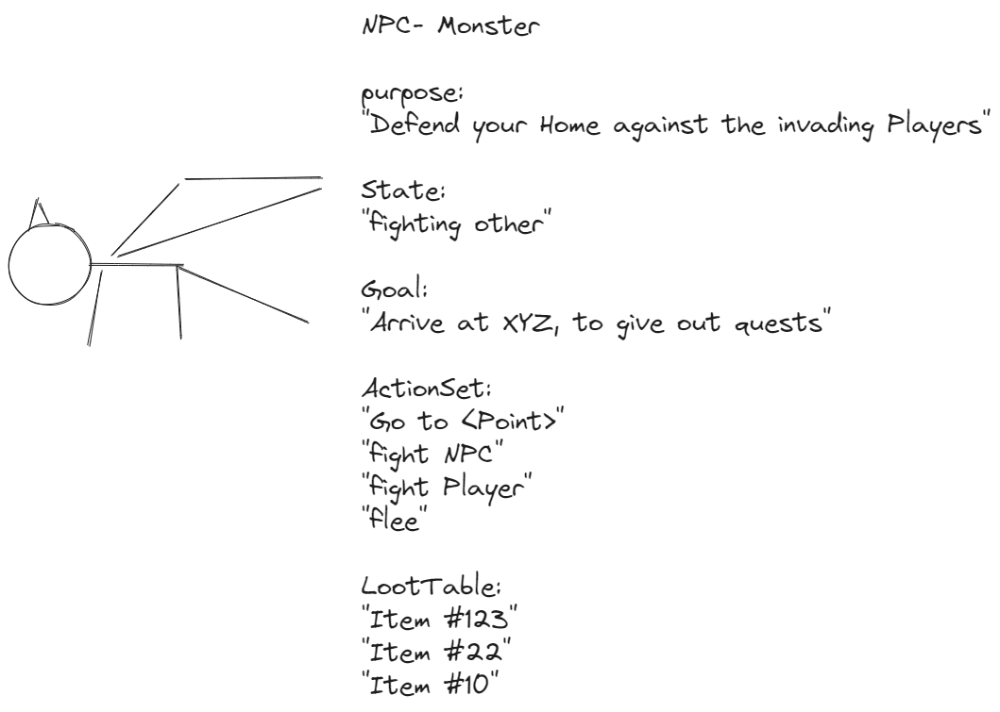
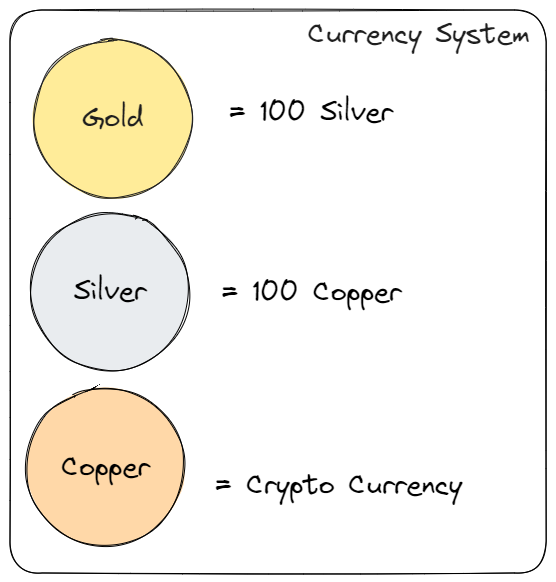

# Hero Mono Repo

Hero is a technology study that aims to combine all the fancy ass stuff and build something really amazing with it. An awesome Fantasy Game, which you should be able to play on any potato VR Gear in the future. Contributions are welcome. I will build it in my spare time based on my Experience with my [WebGPU GameEngine](https://github.com/Razorbob/sbrnk). Movement in VR is not solved for the common user so I have time to build this :). Furthermore the WebXR and WebGPU link is also kinda missing ATM.

## Hero-Engine

Includes a simple ECS, a Physics Engine and multiple Renderers (WebGpu and WebGl).

## Hero-GameServer

the GameServer for the TestGame

## Hero-Editor

the Editor of the GameWorld - this should be the Dev Client

## Hero-Miner

the Miner will be Included in the TestGame, this should be able to run standalone - to support the HeroNetwork.
Why a Blockchain? because it proofs to be a resiliant distributed Database. Its not fast, but thats why we use a Cache on the GameServer (Maybe full P2P in the future, but knowbody has a clue how you would to this IMHO)

## Hero-TestGame

The Test Game will be called Eräthia. It will be a VR Game in the Browser. The holders of Copper Coins will be able to Vote for changes and additions in the Game.

### Character Creation

The Character Creation will be a Survey of your personality. For example a short Myers-Briggs Test. Afterwards you will be assigned a distribution of Afinities based on your personality. Yes you can Lie, but you can only create one Character for some specific time and switching characters will have a time penalty. YOU are the Character!

#### Attributes

- Strength - more physical damage (+ "special attacks")
- Agility - Movementspeed and dodge (+ "assasination attacks")
- Intelligence - spell damage and healing ( + "Spells")
- Health - more Lifepoints
- Fortitude - Mental strength (less chance to piss yourself in combat)

#### Affinities

- Meele Combat (+% meele dmg and meele defense)
- Range Combat (+% range dmg and range defense)
- Pet (+% pet dmg )
- Magic (+ mana and +% magic dmg)
- Divine (+ mana and +% healing)

#### Example Character Creation Dialog

1. Name of your Character
2. Gender of your Character
3. Fill out 10 Questions about yourself
4. Take a selfie (a fantasy Face will be generated via a GAN)
5. Customize Face
6. Fill out 10 more Questions
7. Customize Character
8. Fill out last Questions
9. Get your results
10. Spend 10 Skill points on your Character

### Gameplay

#### Resources

- Mana
- (in VR your own Stamina is also a resource)

Combat skills or Magic both require fundamentaly a combination of movement and speech. YES, you need to cast your spell with your speech (at first).
(In VR this will be exhausting, thats what is ment with the Stamina)

#### Different skill levels

- Novice:
Lot of effort - has to speak out a formular and perform a set of movements for magic
High Mana Cost, you cannot create ur element
 You need an Item to channel your power equipped (Like a Staff or Wand)
- Invoker:
 Medium effort - can use either a movement or just speak the magic enchantment for Novice Magic
 Medium Mana Cost, your spells will be less manaintensive, but creating the element will be high mana Cost
 You still need an Item equipped
- Magister:
 Can bind the single building blocks of magic to a word or movement as he wishes, for Invoker or Below
 Low Mana Cost for spells, medium mana Cost for creating element
 You can use rings (items will only give bonuses)

- Exarch:
 You can combine the building blocks visually and make complex spells with simple words or movements, for Magister level Magic or below
 Minimal Mana cost for everything
 You dont need anything equipped, but rings necklaces and so on will give bonuses
- Sage:
 Is the absolute Top, does have free reign over his element
- God:
 This is someone super stupidly op, which players will never reach

#### Magic Types

Magic is generally elemental

- Fire
- Water
- Air
- Earth
- Light
- Dark

#### NPCs

NPCs will be either Eräthians, which are basically Humanoids like Players or Monsters. The Game Server will have some kind of AI for Dialog (like a local ChatGPT) and some kind of Controller AI which should make the World pretty Dynamic. For Example at night are all the NPCs in Bed or some Salesman decides to switch to another city, because more Adventureres are there. Would be Fun.

##### Homanoids

##### Monsters

#### Currency

#### Ideas

    Everyone will have a spellbook, where you can check your Spells you learned (Also with information of how to perform it, just in case u forgott)

    People learn new stuff through practice or time or just randomly while doing relevant stuff
    Generally there is no skill tree, the magic type you practice will increase.
    Sure there are tomes or scrolls and teachers (also other Players can be teachers) but not at first

    Advancing in one Magic type, will make it harder to learn the others

    Magic is always a combination of different building blocks. A Building block consists basically of a gesture and a spell which u need to say. THE RYTHM is important!
    Magic also initially needs the elements (like avatar)
    For example you want to use firemagic you need to either have the element in your radius (focus it) to use it or you need to create it.
    To create the magic, you could for example snip your fingers and say a spell for firemagic. Then you have a magic building Block to take control of the element, a movement and something to say and than you have a building block to make a ball and then a building block to shoot it.
    Congrats you created a Novice Firball!
    Try maybe not form a Ball but a Cone, than you created Novice Flamelance (which deals more DMG and creates an aoe Flamecone and floor on impact)

    Magic can have a backlash? If you perform a spell wrong you can get hurt - especially on the Higher Tiers
    You will also get pushed back from spells or impacts

#### Additional ideas

    Combinations, what happens if u incinerate your ground and than use earth magic on this ground. => Magma/Lava? Or one Person holds some element and die other applies rotation like in the video
    You are jumping/falling and create earth blocks under your feet (something like the stuff from Fortnite)

#### Inspired by

    Rumble VR
